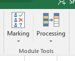
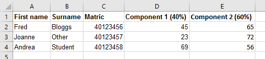
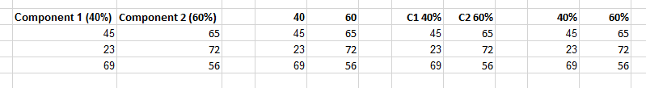
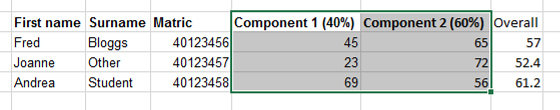
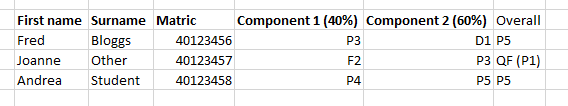
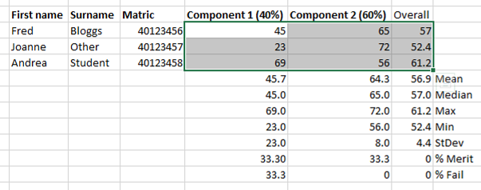
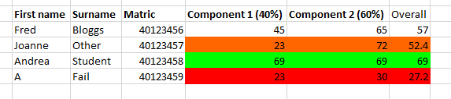
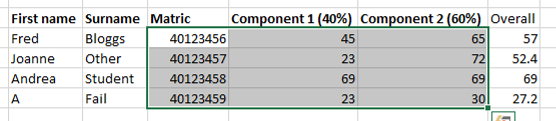

```{r setup, include=FALSE}
knitr::opts_chunk$set(echo = TRUE)
```
***

### What is it and what does it do?

ModuleTools is an add-in for Excel (version 2007 or newer) that performs a range of functions that are common in module administration, to make processing of student data easier.

ModuleTools can do the following:

* Calculate overall module marks from individual component marks and weightings for both BSc and MSc modules (i.e. percentages and grades)

* Calculate component marks from individual assessment elements for both BSc and MSc modules

* Derive summary statistics for components and overall marks (mean, median, standard deviation, max and min, percentage merit and percentage fail for BSc modules, mean grade, percentage distinction and percentage fail for MSc modules)

* Format (through colour) marks based on different ranges (Merit, Pass, QF or Fail for BSc marks)

* Convert matriculation numbers, which often lose the leading '0' when copied into Excel

* Export module assessment component marks to the SITS upload sheets (csv files) to facilitate mark entry

***

### How do I install the Add-in?

The Excel add-in (ModuleTools.xlam) can be downloaded from [https://github.com/robbriers/moduletools](https://github.com/robbriers/moduletools). The easiest way to access the tools is simply to open the file.  You may get a security alert when you try and open the file - you will need to Enable Macros to use the functions.  This may require you to modify your security settings depending on the setup of Excel.

If you want ModuleTools to be available every time you open Excel, use the following steps (assuming Excel 2013 or 16):
Click on File > Options. Click on the Add-ins section on the left of the screen, then choose Manage: Excel Add-ins from the bottom and click Go.  Click Browse, then locate the ModuleTools.xlam file and select it.  Click on OK.  Now whenever you open Excel it will be available on the Home Ribbon.

### How do I use the tools?

When you open the Add-in, a new Menu group is added to the Home Ribbon tools (Module Tools - see below).  This has two Main options: Marking and Processing, which perform different functions.

```{r out.width = "20%", echo=FALSE}

```

***

### Marking tools

These tools need you to have set out the student assessment data in a consistent fashion. This is compatible with the spreadsheets that can be downloaded from the Moodle Gradebook. The required layout is shown below.

```{r out.width = "80%", echo=FALSE}

```


The column headings for each assessment component/element weighting can be written in a number of possible formats, as shown below. The text to the left of the assessment weighting is not important, so can be more descriptive (e.g. Report 40%). Component 1 or C1 are just given as examples. If you really want to use a different format then let me know and I will see if it can be accommodated.

```{r out.width = "90%", echo=FALSE}

```

#### Calculate BSc Marks
This calculates overall module marks, based on the components and weightings given in the spreadsheet.  First select the range of cells that include all the relevant data, **INCLUDING THE COMPONENT WEIGHTINGS**, but not the student names or matriculation numbers.  Then click on Marking > Calculate BSc Marks to perform the calculations. **The output will be written to the column immediately to the right of the marks, so make sure that this is empty.**  An example of the selection of data required is shown below.

```{r out.width = "80%", echo=FALSE}

```


#### Calculate BSc Component
This works in the same way as the function above, but allows you to calculate component marks based on individual assessment elements.

#### Calculate MSc Marks
This works in the same way as the BSc Marks function, but works directly with the F1-6, P1-5, D1-5 grading scheme.  Unlike the Module Grades Calculator spreadsheet that you may have used, you should enter grades in the Fail range as F1 to F6, rather than F-1.

```{r out.width = "80%", echo=FALSE}

```

Overall grades containing a component mark of F2 or lower are marked as QF (Qualified Fail) with the actual calculated grade in brackets after for reference.

#### Calculate MSc Component
This works in the same way as for the BSc Component calculations described above. There is no minimum grade for an element of a component, so there are no QF grades indicated.

#### NOTE THAT BOTH THE BSC AND MSC MARKING TOOLS DO NOT AUTOMATICALLY UPDATE THE CALCULATED MARKS IF YOU CHANGE AN INDIVIDUAL COMPONENT OR ELEMENT MARK - TO UPDATE THE MARKS YOU HAVE TO SELECT ALL THE DATA AGAIN AND CLICK ON THE RELEVANT FUNCTION.

#### Summary Stats
This tool automatically calculates summary statistics (mean - not including blanks, which are assumed to be non-submissions), median, standard deviation, max and min, percentage merit and percentage fail) for BSc student marks and the mean grade, percentage distinction and percentage fail (including QF and F6) for MSc marks.  For the MSc marks the mean is calculated excluding any QF or F6 grades.  Simply select the range of marks (**not including the weightings**) that you wish to be summarised (in a column) and click on Marking > Summary Stats.  If you select multiple columns of marks (for example the marks for each component of assessment) then it will calculate the statistics for each column separately.  For BSc marks the summary statistics will be written to the seven rows below the data column, plus labels in the same area on the column to the right of the marks so ensure that this area does not contain other information or it will be overwritten.  For MSc marks only three rows are needed for the statistics.

An example for BSc marks is shown below.

```{r out.width = "80%", echo=FALSE}

```

#### Highlight grades
This tool automatically highlights different grades of marks for BSc students, based on the following categories:

* Merit (overall mark 65% plus): Green

* Qualified Fail (<30% in one component but overall > 40%): Orange

* Fail (<40% overall): Red

To use the tool, simply select the range containing the marks for all the components of the module **and the overall mark** (in the right-hand column of the range selected) and click on Marking > Highlight Grades.

```{r out.width = "80%", echo=FALSE}

```


#### Do It All!
As the name suggests, this combines the above functions together into one action.  Simply select the data as per the marking tools (i.e. marks and component weightings) and then click on this to calculate overall marks/grades, derive summary statistics and (for BSc marks only) highlight grade ranges.

***

### Processing Tools

#### Convert Matrics
When you paste matriculation numbers into Excel, they commonly lose the initial '0' leaving you one number short.  This is less of a problem than it used to be as current matric numbers start with 4, but until earlier registered students complete, this tool reformats the matriculation numbers to replace the initial zero, and converts them to text format for easier manipulation.  Simply select the range of values to be converted and click on Processing > Convert Matrics.

#### Convert % to Grades
Converts percentages to the relevant MSc grades. The grades are written to the column to the right of the percentages, so make sure that this is empty.

#### Export to SITS sheet - Experimental at present
This allows you to export module component marks for the students to the standard SITS template CSV file that can be provided by the admin team. The data should be laid out as per the previous functions **with component 1 marks in the column before any component 2 marks**. An example is shown below.

```{r out.width = "80%", echo=FALSE}

```

In order to export the marks, first select all of the data to be exported (i.e. matriculation numbers and component marks - **not the column headers**), then click on Processing Tools > Export to SITS.

You will be prompted to locate the CSV file that has ben provided by the admin team for the module. Marks for each assessment will be transcribed from your existing mark spreadsheet to this file if matching matriculation numbers are found. It also checks whether the number of students is the same in your spreadsheet and the SITS CSV file and displays a warning message if they are not the same. You can then check both files to determine which students are missing or extra.

#### Check for Update
There are periodic updates to the add-in, to fix bugs or add new functions. This allows you to check whether you are using the most up-to-date version. You need to be connected to the internet for this to work. If there is a newer version available you will be prompted as to whether you want to download it. It will automatically overwrite the old version. This also runs automatically in the background when the file is opened every 30 days if you do not check manually.

#### Report problem
If you encounter any problems with the tools, this allows you to send an email to me automatically.  If reporting an issue please include as much detail as possible of what you were doing, and ideally a copy (suitably anonymised if necessary) of the data that you were processing and a screenshot of any error messages.Requests for additional functionality will be considered, but I can't make any guarantees!

### License

This software is provided under the terms of the [GNU General Public License v3.0](http://www.gnu.org/licenses/gpl-3.0.txt).